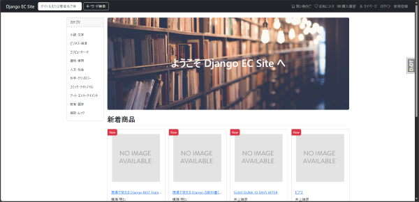
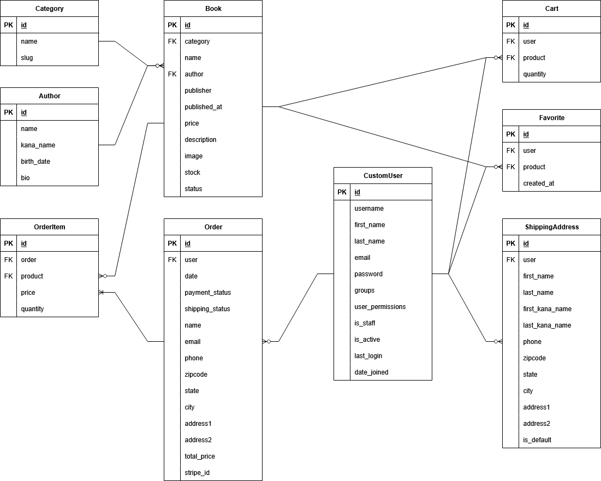
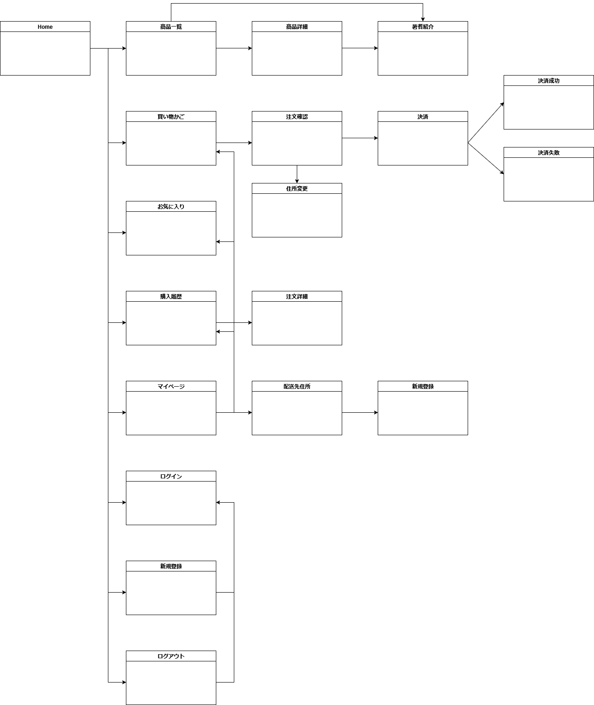

# Django EC Project

Django で構築した書籍販売向け Web アプリケーションです。  
商品閲覧からカート、注文、Stripe 決済まで、一通りの購買フローを実装しています。

## 主な機能

- ユーザー認証（[django-allauth](https://django-allauth.readthedocs.io/en/latest/) 利用）
- 商品一覧・詳細表示
  - 無限スクロール表示
- 簡易検索機能
- お気に入り機能
- カート機能
- Stripe 決済
- 購入履歴の表示
- 配送先住所登録・管理
- Django Admin による商品管理

## 使用技術

- フロントエンド
  - Bootstrap 5.3
  - JavaScript (ES6+)
    - 無限スクロール(Fetch API)
  - django-widget-tweaks
- バックエンド
  - Django 5.2.8
  - django-allauth
  - stripe
  - Pillow
  - python-decouple
- データベース
  - SQLite
- プログラミング言語
  - Python 3.12
  - JavaScript (ES6+)

## ユニットテストについて

現在、Djangoの`unittest`を使って一部のビューに対してユニットテストを実装しています。  
今後、モデルや他のビューのテストも順次追加予定です。

テストの実行方法：
```bash
python manage.py test
```

## 画像について

- トップページの画像は Unsplash にあったもをリサイズして利用しております。

## セットアップ方法

```bash

# 仮想環境作成 & 有効化
python -m venv venv
source venv/bin/activate  # Windows: venv\Scripts\activate

# 依存関係インストール
pip install -r requirements.txt

# マイグレーション実行
python manage.py migrate

# 管理ユーザー作成
python manage.py createsuperuser

# 開発サーバー起動
python manage.py runserver
```

## 画面イメージ




## ER 図

以下は本アプリケーションの主要モデルの関係図です。



## 画面遷移図

以下は本アプリケーションの画面遷移図です。
  
※商品詳細へは買い物かご、お気に入りなど複数の画面からも遷移可能です。
